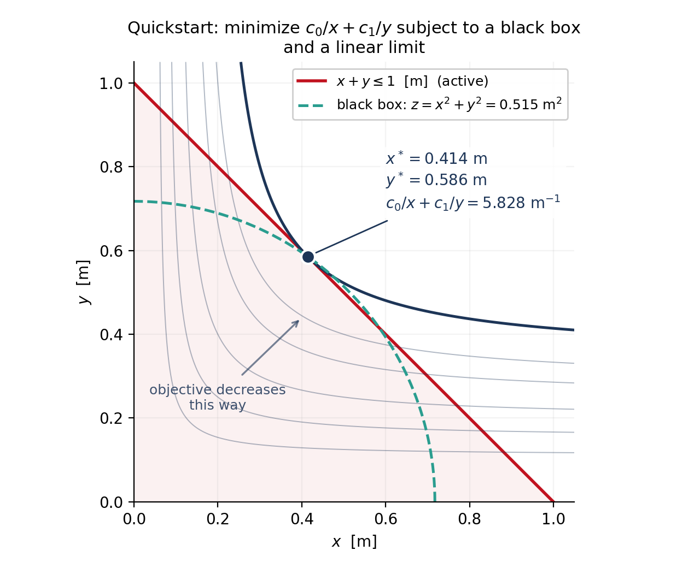

Quickstart
==========

Below is a simple example written using LCsolver that should help get new users off the ground.  For simple problems this example case is fine to build on, but for more advanced techniques (ex: using multi-dimensional variables or advanced black-box usage) see the additional documentation.

.. note::

    Some of the files and examples that appear in this documentation have been adapted to conform to PEP-8 standards, however, we **strongly discourage** the adoption of PEP-8 in the course of regular LCsolver usage as it makes the code (particularly variable declarations, constant declarations, and constraint list declarations) extremely challenging to read and debug

The example shown here minimizes a posynomial objective subject to a black-box
model of the unit circle and a linear limit -- note that the black box
declares its units in feet while the model works in metres, and the conversion
is handled for you:

.. math::
    :nowrap:

    \begin{align*}
        & \underset{x,y,z}{\text{minimize}}
        & & c_0/x + c_1/y \\
        & \text{subject to}
        & & z = x^2 + y^2 \quad \text{(a black box)}\\
        &&& x + y \leq 1.0 \text{ [m]}
    \end{align*}

The black-box constraint makes this a signomial program with an opaque row,
so ``solve`` routes it to SIA and the printed summary opens with a Report
saying exactly that.

    The solution. Both terms of the objective fall as their variable grows, so
    the optimum sits where the limit line stops that push -- at the point where
    an objective contour is tangent to it, :math:`x^* = 0.414` m and
    :math:`y^* = 0.586` m. The black box is evaluated along the way and reports
    :math:`z = 0.515` m\ :sup:`2` there; nothing else in the model constrains
    it, so it is an output rather than a design freedom. The figure is drawn by
    ``utilities/plot_quickstart_solution.py``, which solves this model and
    annotates what came back.

.. literalinclude:: ../examples/unit_circle_blackbox.py
    :language: python
